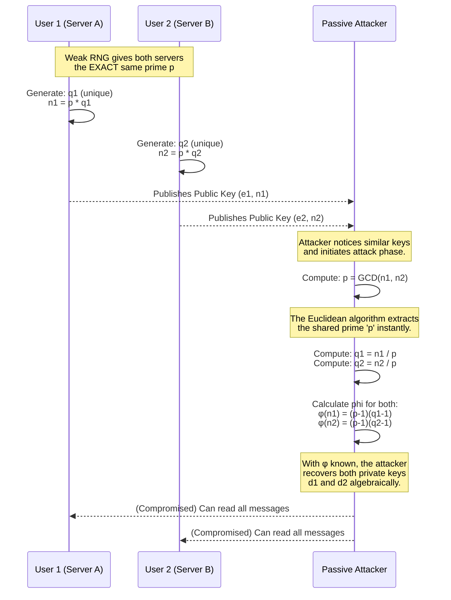

# System & Attack Model

## 1. System & Attack Model

### Overview
The system simulates two RSA key-pair generation scenarios:
1. **Target System**: A naive implementation where a weak Random Number Generator (RNG) is used. It accidentally generates the same prime number $p$ for multiple users, resulting in moduli $n_1$ and $n_2$ that are different, but mathematically linked by this shared prime factor.
2. **Attacker Model**: A passive attacker who only has access to public information—specifically the public encryption keys of two users $(e_1, n_1)$ and $(e_2, n_2)$. The attacker knows the system uses a weak RNG and attempts to exploit this by calculating the Greatest Common Divisor (GCD) of the two public moduli.

### Mermaid Diagram

### Detailed Explanation
In a standard, secure RSA implementation, a user generates two large, cryptographically secure random prime numbers, $p$ and $q$, and multiplies them to create the modulus $n$. The security of this modulus relies entirely on the fact that factoring $n$ back into $p$ and $q$ takes thousands of years using the fastest known algorithms (like the General Number Field Sieve) for modern key sizes (e.g., 2048-bit or larger).

The **vulnerability** occurs when the prime generation process is flawed. If an organization generates keys for thousands of employees using a poorly seeded pseudo-random number generator (PRNG), it is highly probable that the exact same prime number $p$ will be generated for two different users.

User 1 receives $n_1 = p \times q_1$, and User 2 receives $n_2 = p \times q_2$.
Individually, $n_1$ and $n_2$ appear secure and are impossible to factor directly. However, an attacker surveying public certificates can simply run the Euclidean Algorithm on the pair: `GCD(n1, n2)`. 

Because both moduli share the factor $p$, the GCD returns $p$ in mere milliseconds. No brute-force factoring is required. Once $p$ is known, $n_1$ and $n_2$ are instantly divided by $p$ to find $q_1$ and $q_2$. The attacker now has the complete prime factorization of both keys, allowing them to calculate the private decryption keys $d_1$ and $d_2$ just as legitimately as the original users did. 

---

## 2. Code Flow

### Explanation
The Python codebase simulates this exact attack lifecycle. The flow begins in `rsa_common_modulus.py` with a custom Miller-Rabin primality tester calculating primes. 

In the vulnerable scenario, `generate_shared_modulus_keypairs(bits)` intentionally selects a single prime $p$ and uses it to generate two different moduli $n_1$ and $n_2$. 

The attack function `run_attack_on_shared_modulus(kp1, kp2)` implements the attacker's perspective. It ignores the private keys, taking only the public combinations $(n_1, e_1)$ and $(n_2, e_2)$. It calls the built-in `math.gcd()` function. When it identifies that the GCD is a prime $>1$, it immediately derives $q_1$ and $q_2$ via simple division, calculates Euler's totient ($\phi$), and uses the Extended Euclidean Algorithm (`_modinv`) to perfectly recover the private strings $d_1$ and $d_2$. 

The flow loops 25 times in `run_tests()` to provide statistical proof of a 100% exploit rate, which is then dynamically visualized by `graphs.py`.

---

## 3. Pseudo-Algorithm for Attack

### Numbered Steps

**Algorithm:** `CommonModulusFactorizationAttack`
**Inputs:** Public Key 1 `(n1, e1)`, Public Key 2 `(n2, e2)`
**Outputs:** Private Key 1 `(d1)`, Private Key 2 `(d2)`

1. **Calculate Greatest Common Divisor**: `p = GCD(n1, n2)`
2. **Check for Exploitability**: `IF p == 1 THEN Return "Attack Failed" (Keys are secure)`
3. **Extract Remaining Primes**: 
   - `q1 = n1 / p`
   - `q2 = n2 / p`
4. **Calculate Euler's Totients**:
   - `phi1 = (p - 1) * (q1 - 1)`
   - `phi2 = (p - 1) * (q2 - 1)`
5. **Recover Private Exponents (Modular Inverse)**:
   - `d1 = modInverse(e1, phi1)`
   - `d2 = modInverse(e2, phi2)`
6. **Return Compromised Keys**: `Return d1, d2`

### Line-by-Line Explanation

**1. Calculate Greatest Common Divisor: `p = GCD(n1, n2)`**
The attacker feeds the two public moduli into the Euclidean Algorithm. This algorithm efficiently finds the largest number that divides both $n_1$ and $n_2$ without remainder. Because both moduli were generated with the shared prime $p$, the mathematical result is $p$.

**2. Check for Exploitability: `IF p == 1 THEN Return "Attack Failed"`**
If the RNG was secure, $n_1$ and $n_2$ would consist of four completely unique primes. Their greatest common divisor would be 1 (they are coprime). If $p = 1$, the vulnerability does not exist, and the attacker stops.

**3. Extract Remaining Primes: `q1 = n1 / p`, `q2 = n2 / p`**
Because the attacker now possesses $p$ and $n_1$ (where $n_1 = p \times q_1$), finding the second prime $q_1$ is a trivial algebraic division. The attacker repeats this for $n_2$ to find $q_2$. Both original keys are now fully factored.

**4. Calculate Euler's Totients: `phi1 = (p - 1) * (q1 - 1)`...**
Euler's totient function, $\phi(n)$, counts the positive integers up to $n$ that are relatively prime to $n$. In RSA, $\phi(n)$ is essential to generating the private key. Because the attacker knows the prime factors, they calculate $\phi(n_1)$ and $\phi(n_2)$ using standard RSA formulas.

**5. Recover Private Exponents: `d1 = modInverse(e1, phi1)...`**
The mathematical definition of an RSA private key $d$ is that $e \times d \equiv 1 \pmod{\phi(n)}$. Because the attacker knows $e_1$ (public knowledge) and just calculated $\phi_1$, they run the Extended Euclidean Algorithm (`modInverse`) to solve for $d_1$. They repeat this for $d_2$.

**6. Return Compromised Keys: `Return d1, d2`**
The attack completes successfully. The attacker now possesses the exact private keys held by User 1 and User 2, and can decrypt any future communications silently, completely breaking the system's confidentiality.
